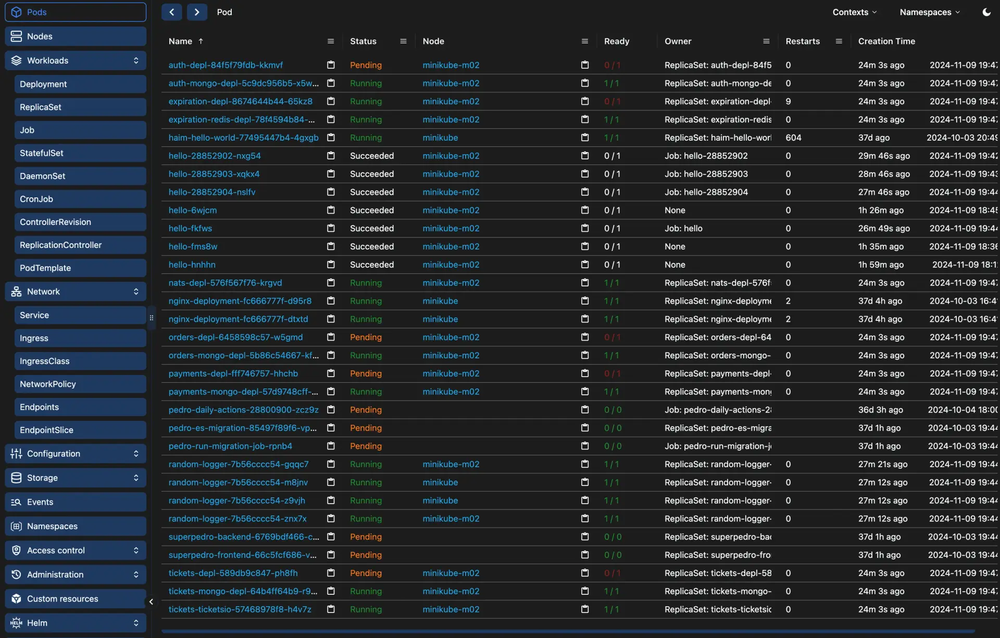

 

<h3 align="center">Grogg - Kubernetes Made Easy
</h3>

Welcome to Grogg, the ultimate Kubernetes GUI client for managing multiple clusters!
 
<a href="https://grogg.app/"><strong>Get Started Now »</strong></a>
 
 
<a href="https://youtu.be/w19awlqFUUU?si=Vi8Tgv-Kcn7QZzUB/">View Demo</a> |
<a href="https://github.com/groggapp/groggapp/issues/new?template=bug_report.yaml">Report a Bug</a> |
<a href="https://github.com/groggapp/groggapp/issues/new?template=feature_request.yaml">Request a Feature</a> |
<a href="https://grogg.app/affiliates">Become an Affiliate</a>

## About

 
Grogg is designed to simplify Kubernetes workflows, enhance productivity, and provide a seamless experience for developers, DevOps professionals, and sysadmins alike.
 
 

With Grogg, managing Kubernetes clusters becomes effortless—whether you're a beginner or a seasoned expert.

### Features

#### 🛠️ Intuitive Kubernetes Management

Streamlined, user-friendly interface for managing Kubernetes resources.
Visualize and navigate clusters, pods, deployments, and services directly from VSCode.
Eliminate the need for complex kubectl commands.

#### 🔑 Multi-Cluster Support

Manage multiple Kubernetes clusters seamlessly within the same interface.
Easily switch between clusters without manual kubectl configuration.

#### 📊 Advanced Troubleshooting Tools

Integrated log viewer to quickly identify and debug issues across resources.
Smart filtering and search capabilities to drill down into diagnostics.

### Compared to kubectl

- No need to memorize complex commands or flags.
- Reduce human error with an intuitive GUI.
- Quickly visualize relationships between resources instead of parsing CLI output.

### Compared to Other GUI Clients

- Reduced context switching - stay in your favorite IDE
- Lightweight, fast, and responsive

## Usage

Grogg is a paid product, you can join and purchase your license over at [grogg.app](https://grogg.app).

Once you have a license, you must download the extension and validate the license and thats it!

## Help & Support

- Follow us on [X](https://x.com/groggapp)
- Start a discussion on Github
- Open a bug report or a feature request
- Email us over at hello@grogg.app
